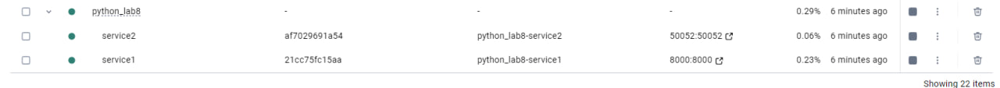

# Лабораторная работа #8. RPC. gRPC. Protobuf

## Запуск и развёртывание

```bash
docker-compose up --build
```



## Демонстрация
### Swagger


### Получение списка всех терминов.

```
curl -X 'GET' \
  'http://localhost:8000/terms/' \
  -H 'accept: application/json'
```


### Получение информации о конкретном термине по ключевому слову.


``` 
curl -X 'GET' \
  'http://localhost:8000/terms/search/?keyword=saga' \
  -H 'accept: application/json'
```


### Получение термина по id

```
curl -X 'GET' \
  'http://localhost:8000/terms/15' \
  -H 'accept: application/json'
```


### Добавление нового термина с описанием.
```
curl -X 'POST' \
  'http://localhost:8000/terms/' \
  -H 'accept: application/json' \
  -H 'Content-Type: application/json' \
  -d '{
  "keyword": "test123",
  "description": "desc123"
}'
```

### Обновление существующего термина.

```
curl -X 'PUT' \
  'http://localhost:8000/terms/12' \
  -H 'accept: application/json' \
  -H 'Content-Type: application/json' \
  -d '{
  "keyword": "test1",
  "description": "Test word 1"
}'
```


### Удаление термина из глоссария.

``` 
curl -X 'DELETE' \
  'http://localhost:8000/terms/12' \
  -H 'accept: application/json'
```


